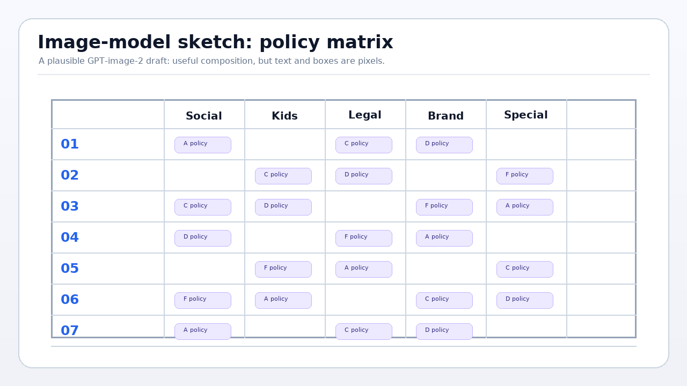
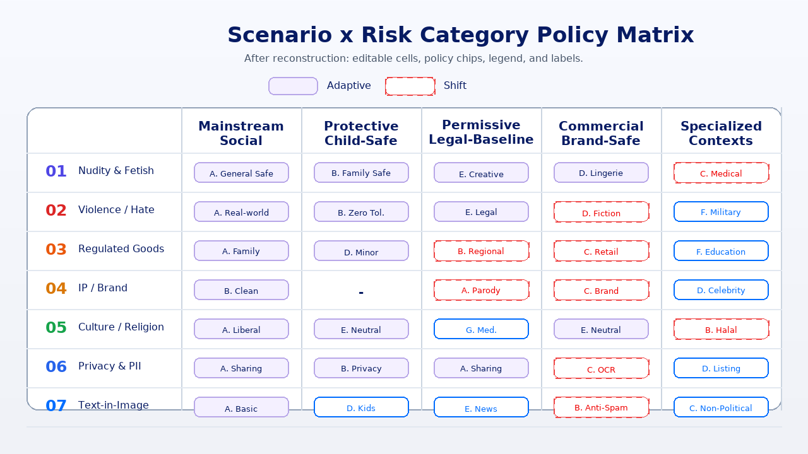
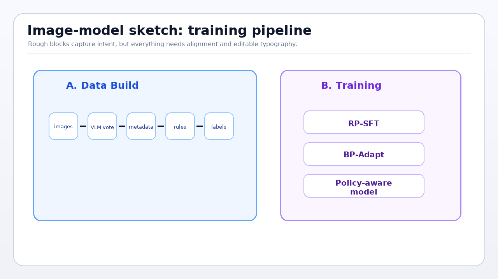
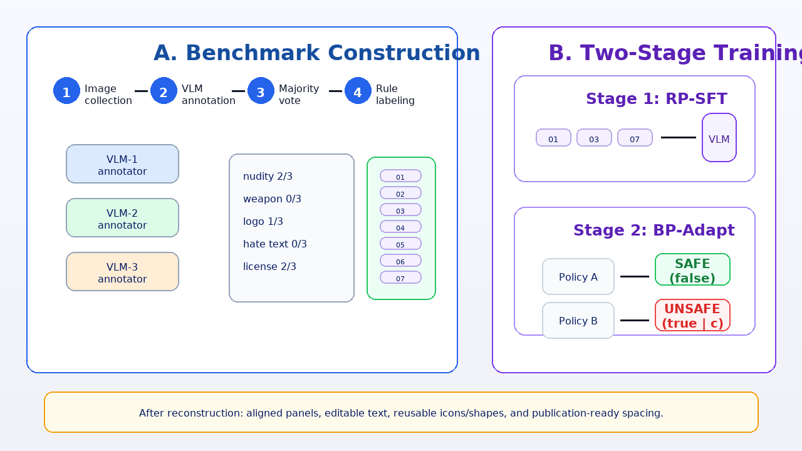
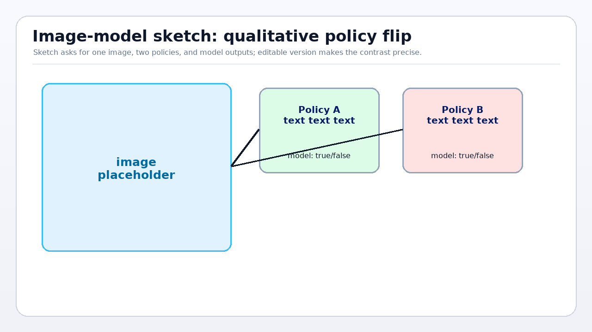
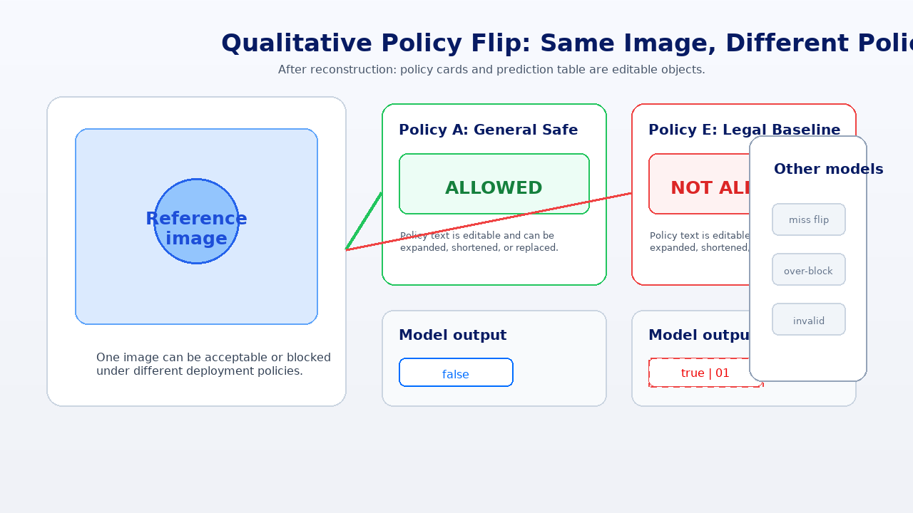

# Draw.io Figure Skill

**Visual reconstruction for editable research figures.**

This skill helps coding agents turn screenshots, PNG mockups, and dense paper figures into editable artifacts:

- `.drawio` / diagrams.net files with editable boxes, labels, arrows, tables, and icon layers.
- `.pptx` slides with editable PowerPoint shapes and text boxes.
- Google Drive updates through `rclone`, with backup-first and verify-after-write workflows.

It is designed for paper figures, architecture diagrams, benchmark matrices, qualitative result galleries, and presentation-ready visuals where a flat bitmap is not enough.

## Sketch First, Then Make It Editable

A productive workflow is to use an image model for ideation, then use this skill for editable reconstruction:

1. Ask **gpt-image-2** or another image model to generate a rough visual draft.
2. Give the PNG draft to your coding agent.
3. Ask the agent to load this skill and rebuild the figure as `.drawio` or `.pptx`.
4. Polish the result in diagrams.net, PowerPoint, or Google Drive with all major elements still editable.

Example prompt:

```text
First use gpt-image-2 to sketch a clean paper figure for a two-stage training pipeline.
Then use this skill: https://github.com/ssmisya/drawio-figure-skill
Reconstruct the sketch as editable draw.io. Search for matching SVG icons.
Keep text, panels, arrows, tables, and chips editable. Do not flatten the whole figure into a bitmap.
```

## Before / After Gallery

These examples show the intended workflow: use a rough image-model sketch to establish composition, then reconstruct it as an editable figure.

| Rough PNG sketch | Editable reconstruction preview |
|---|---|
|  |  |
|  |  |
|  |  |

The preview images are screenshots/renders for the README. The actual deliverables should be editable `.drawio` or `.pptx` files.

## Why This Exists

Most "image to diagram" workflows silently produce a single flattened image. That is not useful when you need to revise text, move panels, align tables, or polish a camera-ready figure.

This skill uses a different principle:

> Reconstruct the visual structure as editable objects. Embed raster content only when the object itself is inherently an image.

The agent reads the reference, infers layout primitives, searches for license-clear SVG icons when needed, and writes real `.drawio` XML or `.pptx` OpenXML.

## Quick Start

The simplest way is to tell your agent to load this skill from GitHub:

```text
Load this skill: https://github.com/ssmisya/drawio-figure-skill
Convert this PNG into an editable draw.io figure. Search for matching SVG icons and keep text, boxes, chips, arrows, and tables editable.
```

For Claude Code, Codex, or other coding agents:

```text
Use the drawio-figure skill from https://github.com/ssmisya/drawio-figure-skill.
Reconstruct this screenshot as an editable PPTX slide, not a flat background image.
```

If your agent supports local skills, install it into your skill directory:

```bash
git clone https://github.com/ssmisya/drawio-figure-skill.git
mkdir -p ~/.agents/skills
cp -R drawio-figure-skill ~/.agents/skills/drawio-figure
```

For Codex-style skill folders, you can also place it under your configured `$CODEX_HOME/skills` directory:

```bash
mkdir -p "${CODEX_HOME:-$HOME/.codex}/skills"
cp -R drawio-figure-skill "${CODEX_HOME:-$HOME/.codex}/skills/drawio-figure"
```

## What To Ask

### PNG to editable draw.io

```text
Use drawio-figure. Convert this PNG into a fully editable .drawio file.
Keep panels, tables, arrows, labels, and policy chips editable. Search for matching open-source SVG icons.
```

### PNG to editable PPTX

```text
Use drawio-figure. Rebuild this screenshot as an editable PowerPoint slide.
Do not use a single background image. Use PowerPoint shapes/text boxes for layout objects.
```

### Update an existing Google Drive draw.io

```text
Use drawio-figure. Download this Google Drive draw.io file, back it up, replace page 4 with the reconstructed figure, upload it back, then verify the page count.
```

### Make a paper figure from a rough sketch

```text
Use drawio-figure. Build a clean draw.io figure from this rough layout:
left panel = data construction, right panel = two-stage training, bottom strip = three takeaways.
Use editable objects and a conference-paper visual style.
```

### Start from a gpt-image-2 sketch

```text
Use gpt-image-2 to generate a polished sketch of a benchmark matrix figure.
Then load https://github.com/ssmisya/drawio-figure-skill and reconstruct the sketch as editable draw.io.
Preserve the visual style, but rebuild text, cells, chips, icons, arrows, and legend as editable objects.
```

## Examples

This repository includes a minimal generated example:

| Example | Source | Output | What It Shows |
|---|---|---|---|
| Editable matrix card | `scripts/make_minimal_examples.py` | `examples/minimal/policy_matrix.drawio` | Native draw.io cells, policy chips, legend, editable labels |
| Editable slide | `scripts/make_minimal_examples.py` | `examples/minimal/policy_matrix.pptx` | PPTX OpenXML shapes and text boxes, no image-only slide |

Generate or refresh them:

```bash
python scripts/make_minimal_examples.py
python scripts/make_gallery_images.py
bash scripts/validate_artifacts.sh examples/minimal
```

## Output Guarantees

The skill should aim for these properties:

- Text remains editable.
- Boxes, cards, chips, arrows, lines, and tables remain editable.
- Icons are separate movable/scalable SVG or image objects.
- Raster images are embedded only when the visual content is inherently a picture.
- `.drawio` files are self-contained and XML-parseable.
- `.pptx` files pass `unzip -t` and contain valid OpenXML parts.
- Google Drive writes are backup-first and verify-after-write.

## Icon Policy

For high-fidelity reconstruction, the agent should search for real SVG icons instead of using emoji placeholders.

Recommended sources:

- [Tabler Icons](https://tabler.io/icons), MIT
- [Lucide](https://lucide.dev), ISC
- [Bootstrap Icons](https://icons.getbootstrap.com), MIT
- [Material Symbols](https://fonts.google.com/icons), Apache 2.0

Avoid random web icons unless the license is clear for your intended use.

## Google Drive Workflow

This skill assumes the agent can access Google Drive through `rclone`.

Typical setup:

```bash
rclone config
rclone lsf gdrive:
```

Safe update pattern:

```bash
rclone copyto gdrive:figure.drawio /tmp/figure.before.drawio
# agent edits /tmp/figure.edit.drawio locally
python - <<'PY'
import xml.etree.ElementTree as ET
ET.parse('/tmp/figure.edit.drawio')
print('drawio ok')
PY
rclone copyto /tmp/figure.edit.drawio gdrive:figure.drawio
rclone copyto gdrive:figure.drawio /tmp/figure.after.drawio
```

For PPTX uploads:

```bash
unzip -t figure.pptx
rclone copyto figure.pptx gdrive:figure.pptx
rclone copyto gdrive:figure.pptx /tmp/figure.after.pptx
unzip -t /tmp/figure.after.pptx
```

## Repository Layout

```text
.
├── SKILL.md
├── README.md
├── examples/
│   ├── gallery/
│   │   ├── 01_policy_matrix_before.png
│   │   └── 01_policy_matrix_after.png
│   └── minimal/
│       ├── policy_matrix.drawio
│       └── policy_matrix.pptx
├── scripts/
│   ├── make_gallery_images.py
│   ├── make_minimal_examples.py
│   └── validate_artifacts.sh
└── LICENSE
```

## Practical Limitations

This is not magic OCR-to-vector conversion. It is agent-guided visual reconstruction.

- If the reference is a PNG, the agent cannot recover original hidden layers.
- It can rebuild the visible structure into editable layers.
- Embedded photos remain raster images.
- Embedded SVG icons are movable/scalable; their paths are not always edited as native draw.io shapes unless explicitly reconstructed.

That distinction matters. It prevents false promises and produces files you can actually edit.

## License

MIT.
